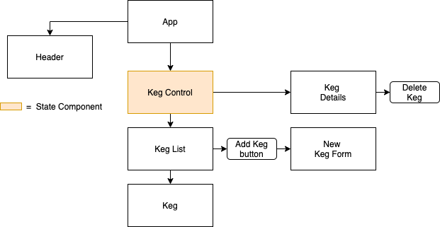

# Tay's Tap Room

#### React app created for a restaurant to keep track of kegs in stock, how many pints are left, and other details about the beer itself. This site incorporates Create, Read, and Delete functionality. Designed for an Epicodus independent project, showcasing React fundamentals. 

## Technologies Used 
React

ES6

JSX

Bootstrap

Node

## User Stories
1. As a user, I want to see a list/menu of all available kegs. For each keg, I want to see its name, brand, price and alcoholContent (or perhaps something like flavor for a kombucha store).
2. As a user, I want to submit a form to add a new keg to a list.
3. As a user, I want to be able to click on a keg to see its detail page.
4. As a user, I want to see how many pints are left in a keg. Hint: A full keg has roughly 124 pints.
5. As a user, I want to be able to click a button next to a keg whenever I sell a pint of it. This should decrease the number of pints left by 1. Pints should not be able to go below 0.

**Further Exploration**

6. As a user, I want to be able to delete a keg.
7. As a user, I want a keg to update to say "Out of Stock" once it's empty.

## Component Diagram


## Setup & Installation

1. You will need Node.js and a code editor like [VSCode](https://code.visualstudio.com/download) to download and setup this application
  * Check to see if you have Node installed by typing `node -v` in your terminal. If not you can download [here](https://nodejs.org/en/)
2. Click the green `Code` button at the top of this GitHub page, select `Download ZIP`, unzip the file  and open in your code editor. Or see step 3 for alternate method.
3. Alternatively, open your terminal and navigate to where you want this repo to be downloaded. Then run the following 3 commands:

```
git clone https://github.com/taylulz/Tap-Room.git
```
```
cd Tap-Room
```
```
code .
```
4. Now run the following command `npm install` to install necessary dependencies
5. To see the application, run `npm start` which should automatically open in your browser. If it does not pop up automatically you may need to navigate to http://localhost:3000 in your browser manually

## Support and contact
Please reach out [here](mailto:taylulzcode@gmail.com) if you need any assistance

## Future Features
Add an 'Edit Keg' button to 'Keg Details' page

Make a resuable form that both 'Add Keg' and 'Edit Keg' can use

Show different pictures/colors when a keg has <= 20 pints left

## Known Bugs
Selling a pint button not working


get editForm to automatically populate previous Keg props

Move all state to redux

_no known bugs at this timegit_
